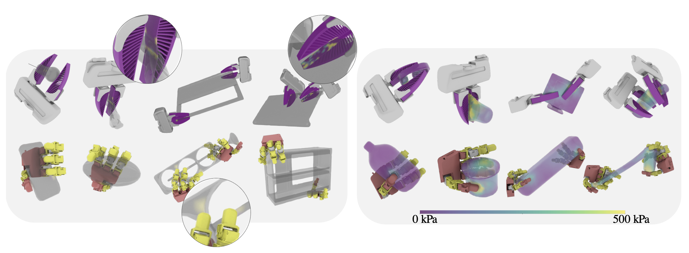

# GRIP: A General Robotic Incremental Potential Contact Simulation Dataset for Unified Deformable-Rigid Coupled Grasping
## [Paper](https://arxiv.org/abs/2503.05020) | [Project Page](https://bell0o.github.io/GRIP/) | [Data](https://ucla.box.com/s/zc1fxvv2cj5ynodtoirykojggqw051g7) 

<!-- TODO: add Video link -->
## 🧭 Introduction

Grasping is fundamental to robotic manipulation, and recent advances in large-scale grasping datasets have provided essential training data and evaluation benchmarks, accelerating the development of learning-based methods for robust object grasping. However, most existing datasets exclude deformable bodies due to the lack of scalable, robust simulation pipelines, limiting the development of generalizable models for compliant grippers and soft manipulands. To address these challenges, we present GRIP, a General Robotic Incremental Potential contact simulation dataset for universal grasping. GRIP leverages an optimized Incremental Potential Contact (IPC)-based simulator for multi-environment data generation, achieving up to 48x speedup while ensuring efficient, intersection- and inversion-free simulations for compliant grippers and deformable objects. Our fully automated pipeline generates and evaluates diverse grasp interactions across 1,200 objects and 100,000 grasp poses, incorporating both soft and rigid grippers. The GRIP dataset enables applications such as neural grasp generation and stress field prediction.

## 📌 Release Plan

- [ ] Release of all soft & rigid gripper datasets  
  - [x] `finray` dataset  
  - [ ] `bifinray` dataset  
  - [ ] `leaphand` dataset  
  - [ ] `bileaphand` dataset  

- [ ] Release of unified data generation pipeline
- [ ] Release of dataset visualization toolkit

> 💡 `bifinray` = bimanual finray, `bileap` = bimanual leaphand

## 📦 Dataset Download
The complete dataset can be downloaded from:  
👉 [UCLA Box]([xxx](https://ucla.box.com/s/zc1fxvv2cj5ynodtoirykojggqw051g7)) 

Due to its large size, the dataset archive `finray_soft_837.tar.gz` is split into multiple chunks (each under 40 GB). The folder structure is as follows:

```
grasp-dataset/
└── release_version/
    ├── finray_soft_837
    ├── finray_soft_837.part.aa
    ├── finray_soft_837.part.ab
    ├── ...
```

Download all chunk files from the appropriate `release_version/` subfolder, navigate into that directory, and run:

```bash
cat finray_soft_837.part.* > finray_soft_837.tar.gz
```

Then extract the dataset with:

```bash
tar -xzvf finray_soft_837.tar.gz
```

> ‼️ Make sure you have sufficient disk space (>1T) before merging and extracting the archive.


## 🛠️ Environment setup

```bash
conda create -n grip python=3.10
conda activate grip
pip install -r requirements.txt
```

## 🚀 Quick Start
#### 0. Prepare demo dataset
Download the demo dataset from [dataset.zip](https://ucla.box.com/s/t6b0744fy3bnjkrf30tv3p1yom0fde3m) and extract it into the `grip-dataset/` directory.

After extraction, the folder structure should look like this:

```
grip-dataset/
├── dataset/
├── models/
├── README.md
├── ...
```


#### 1. Visualize data structure
To inspect the internal structure of an `.h5` file (e.g., groups, datasets, shapes), open the notebook:

```bash
scripts/view_h5.ipynb
```


#### 2. Visualize trajectories
Use the following command to visualize a specific grasp trajectory from the dataset and save the visualization video:

```bash
python scripts/finray_h5_visualizer.py \
  --h5_path dataset/data/finray_core-bottle-2f4ec01bad6cd5ac488017d48a7f7eb4_rigid.h5 \
  --pose_id 0 \
  --video_folder output
```

You can change `--pose_id` to select different trajectories.

## 📁 Dataset Structure

This dataset includes **8 subsets**, each representing simulated grasps with different hand types, material properties (soft or rigid), and number of unique objects:

* `finray_soft_837` / `finray_rigid_710`
* More dataset coming soon...
<!-- * `leaphand_soft_500` / `leaphand_rigid_500`
* `bifinray_soft_500` / `bifinray_rigid_500`
* `bileap_soft_500` / `bileap_rigid_500`

 -->
Each subset is provided as a `.tar.gz` archive. After extraction, the folder structure is as follows:

```
finray_soft_837/
├── finray_core-knife-<object_id>_soft.h5
├── finray_sem-DrinkingUtensil-<object_id>_soft.h5
└── ...
```

Each subfolder corresponds to a single object trial and follows the naming format:

```
<hand_type>_<object_name>_<material_type>
```

Where:

* `hand_type`: e.g., `finray_core`, `leaphand`, `bimanual-leaphand`
* `object_name`: object category and its unique identifier.
* `material_type`: `soft` or `rigid`


Each `.h5` file contains two main groups:

### 1. `object_config`:

Each `object_config/` group contains physical properties of the object:

- `object_type`: string — object category, e.g., `"knife"`
- `object_density`: string or float — density of the object
- `object_youngs`: float64 — Young’s modulus (elasticity)
- `object_poisson`: float64 — Poisson’s ratio
- `object_fric`: float64 — friction coefficient between object and surface
- `ground_fric`: float64 — friction coefficient of the ground

---

### 2. `trajectories`: 

Each `trajectories/` group contains full temporal simulation data :

#### Finray
Each Finray H5 file contains `20` successful grasp trajectories, each with `100` frames. The first `40` frames capture the grasping process, while the remaining `60` frames are used for validation under 6-DoF gravity to filter out failure cases.


| Dataset Key          | Shape Example | Description                                           |
| -------------------- | ------------- | ----------------------------------------------------- |
| `*_joint_states`     | (N, 3)        | Gripper joint states  |
| `*_tf_states`        | (N, 4, 4)     | Gripper SE(3) poses                                   |
| `hand_translation`   | (N, 3)        | Gripper base position                                 |
| `hand_rotation`      | (N, 3, 3)     | Gripper base orientation                              |
| `leftfinger_points`  | (N, V, 3)     | Left finger mesh vertices                             |
| `leftfinger_cells`   | (F, 4)        | Left finger tetrahedral connectivity                  |
| `rightfinger_points` | (N, V, 3)     | Right finger mesh vertices                            |
| `rightfinger_cells`  | (F, 4)        | Right finger tetrahedral connectivity                 |
| `object_points`      | (N, V, 3)     | Object surface points                                 |
| `object_states`      | (N, V, 3)     | Object states for differentiable simulation           |
| `object_cells`       | (F, 4)        | Object tetrahedral mesh                               |
| `*_f_collisions`     | (N, P, 3)     | Per-frame contact points (left/right finger & object) |
| `*_f_frictions`      | (N, P, 3)     | Per-frame friction forces at contact points           |

* `leftfinger_`, `rightfinger_`: finray finger meshes
* `object_`: target object
* `*_f_collisions`, `*_f_frictions`: contact data for each frame


---
## 📚 BibTeX Citation

To cite us, please use the following:

```bibtex
@misc{ma2025gripgeneralroboticincremental,
      title={GRIP: A General Robotic Incremental Potential Contact Simulation Dataset for Unified Deformable-Rigid Coupled Grasping}, 
      author={Siyu Ma and Wenxin Du and Chang Yu and Ying Jiang and Zeshun Zong and Tianyi Xie and Yunuo Chen and Yin Yang and Xuchen Han and Chenfanfu Jiang},
      year={2025},
      eprint={2503.05020},
      archivePrefix={arXiv},
      primaryClass={cs.RO},
      url={https://arxiv.org/abs/2503.05020}, 
}
```


## 📄 License

This work and the dataset are licensed under [CC BY-NC 4.0](https://creativecommons.org/licenses/by-nc/4.0/).


## 📧 Contact
If you have any questions, please open a github issue or contact us:

Siyu Ma: <siiyuma@outlook.com>, Wenxin Du: <setsunainn@gmail.com>, Chang Yu: <g1n0st@live.com>, Chenfanfu Jiang: <chenfanfu.jiang@gmail.com>
